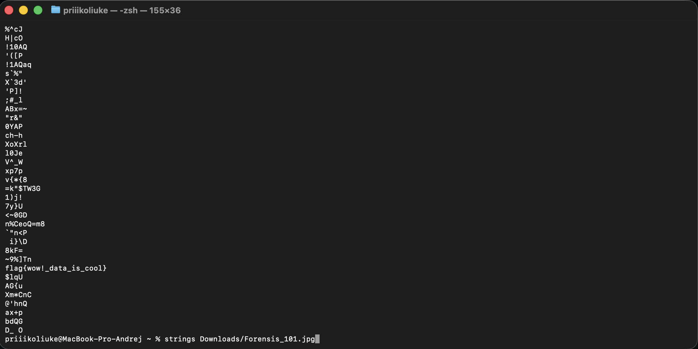

# Отчет по CTF Заданию: Forensics 101

## Исходные данные
Предоставлен файл: `Forensis_101.jpg`.

## Шаги выполнения
1. Анализ файла на наличие скрытой информации.

Использован инструмент `strings` для извлечения всех читаемых строк из бинарного файла:

Обнаружен флаг, осталось написать его в нужном виде
## Результат

В ходе анализа обнаружен флаг:

`mospoly{wow!_data_is_cool}`
