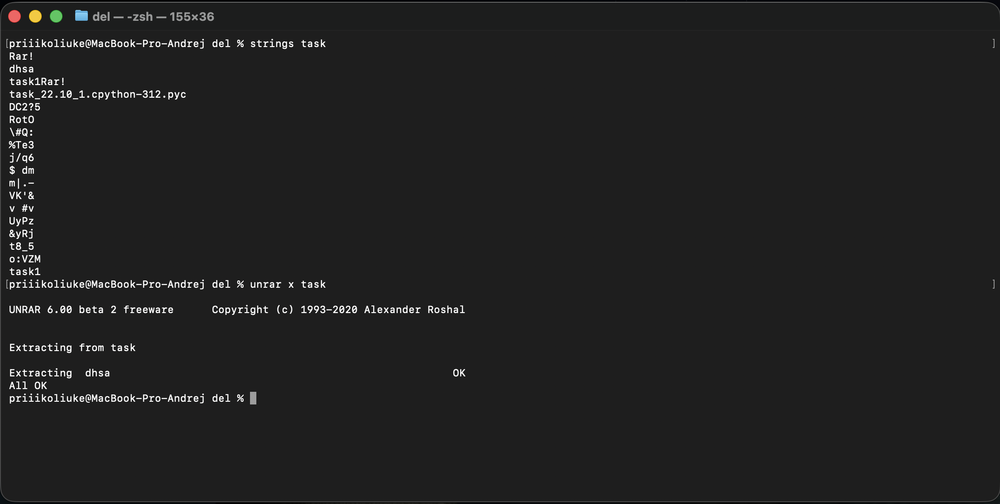
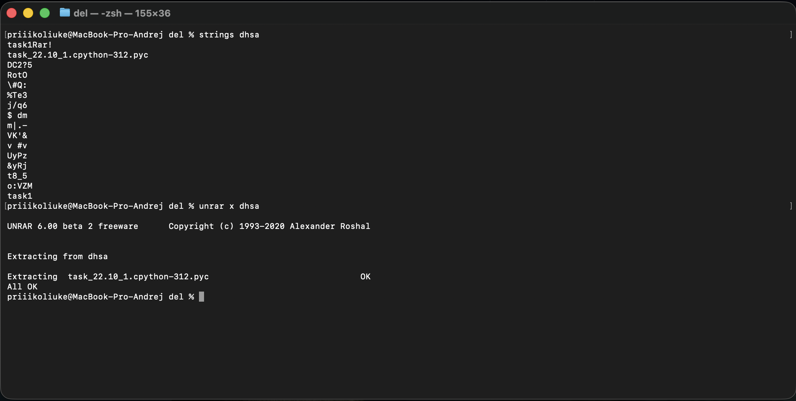
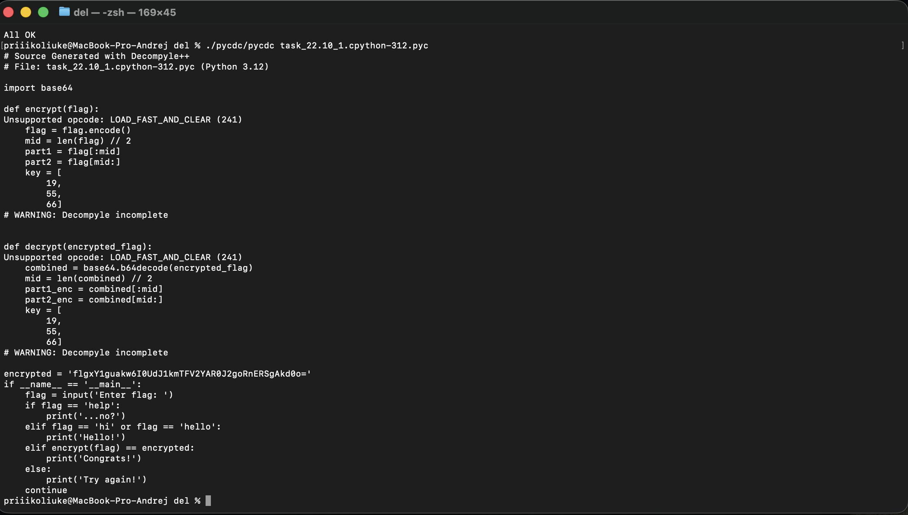
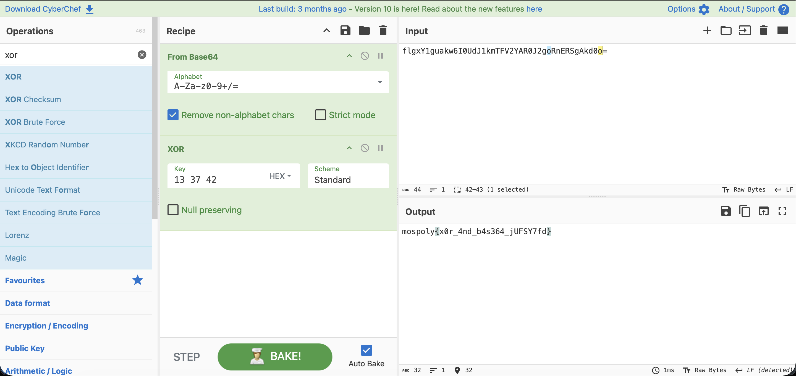
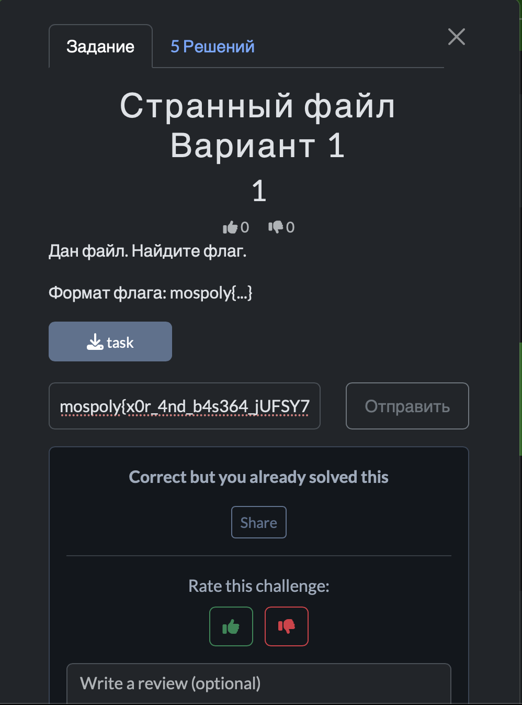

# Отчет по заданию: Странный файл

## Исходные данные
Файл: `task`.

## Шаги выполнения
1. Просмотр файла

С помощью strings просмотр файл вначале увидим строку `Rar!`, скорее всего это RAR архив, попробуем распаковать его через unrar:

2. Просмотр файла 2

Повторно используем strings на файле `dhsa` полученном из архива и видим снова ту же строку, повторяем процедуру: 

3. Декомпиляция

Получаем файл task_22.10_1.cpython-312.pyc, который является скомпилированным байт кодом файла Python, исходного файла нет, поэтому попробуем получить его через pycdc:

4. Декодирование

Местами не удалось декомпилировать, но основное видно: используется XOR на base64, ключ для XOR из кода: `19 55 66`, base64 строка: `flgxY1guakw6I0UdJ1kmTFV2YAR0J2goRnERSgAkd0o=`.

Декодируем это через CyberChef:

И видим флаг

## Результат

В ходе анализа обнаружен флаг:

`mospoly{x0r_4nd_b4s364_jUFSY7fd}`

