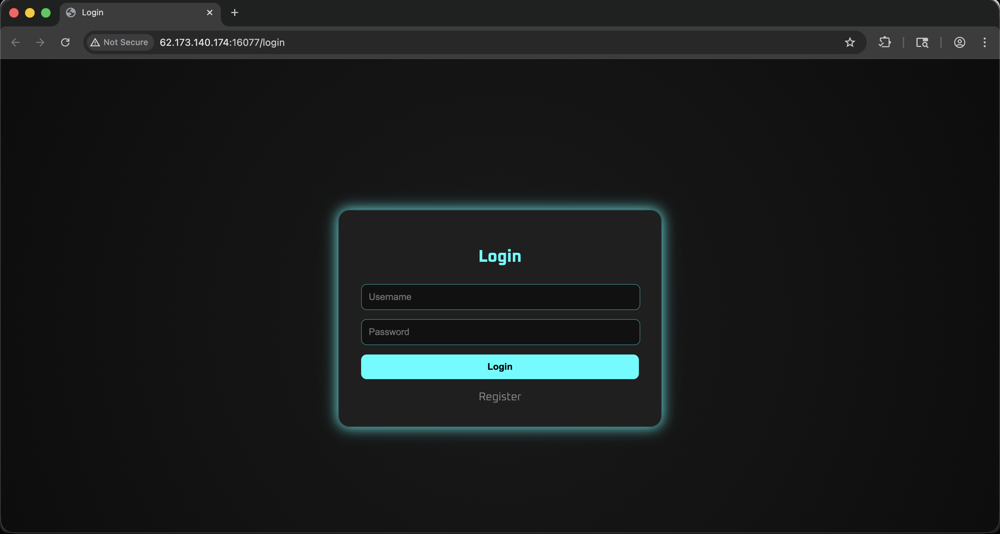
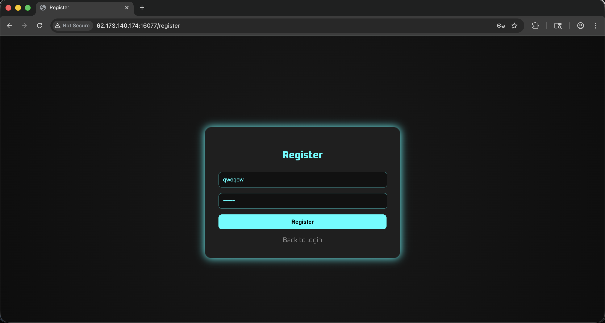
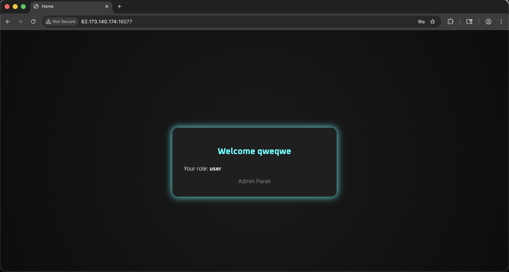
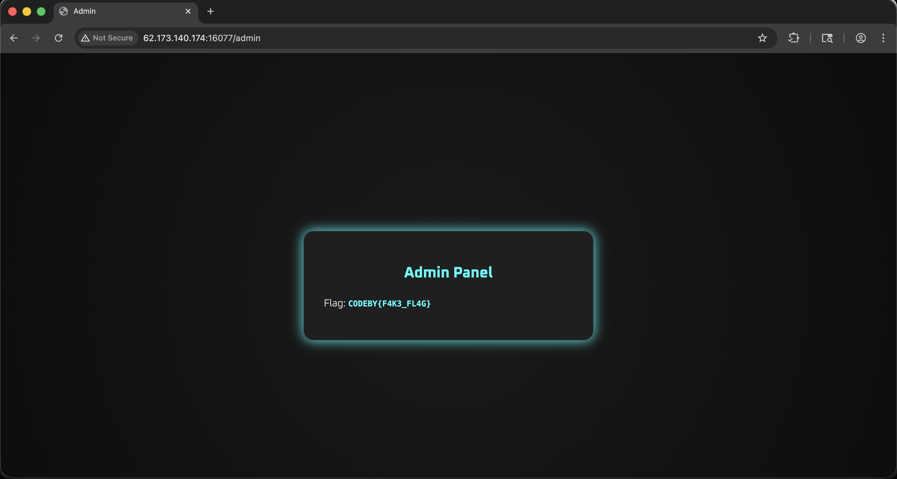
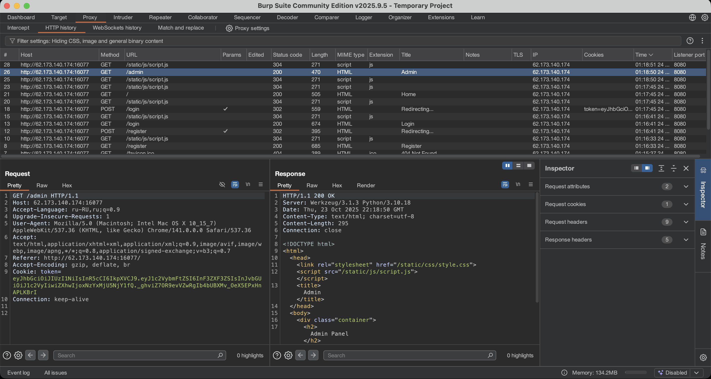
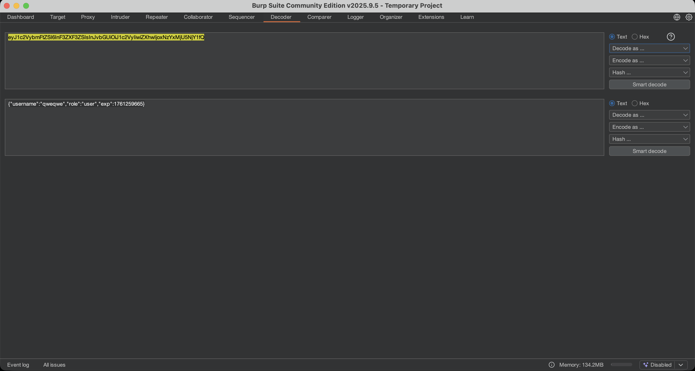
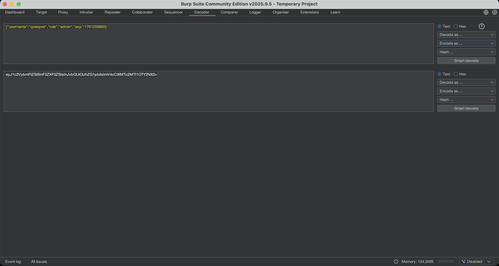
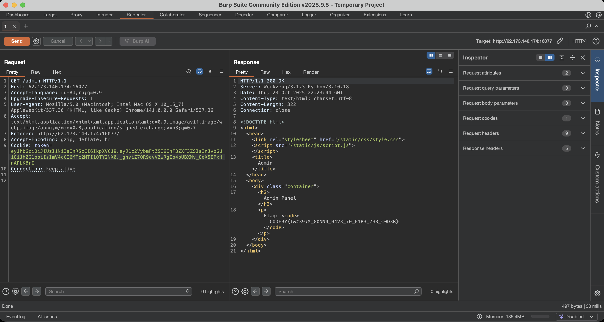
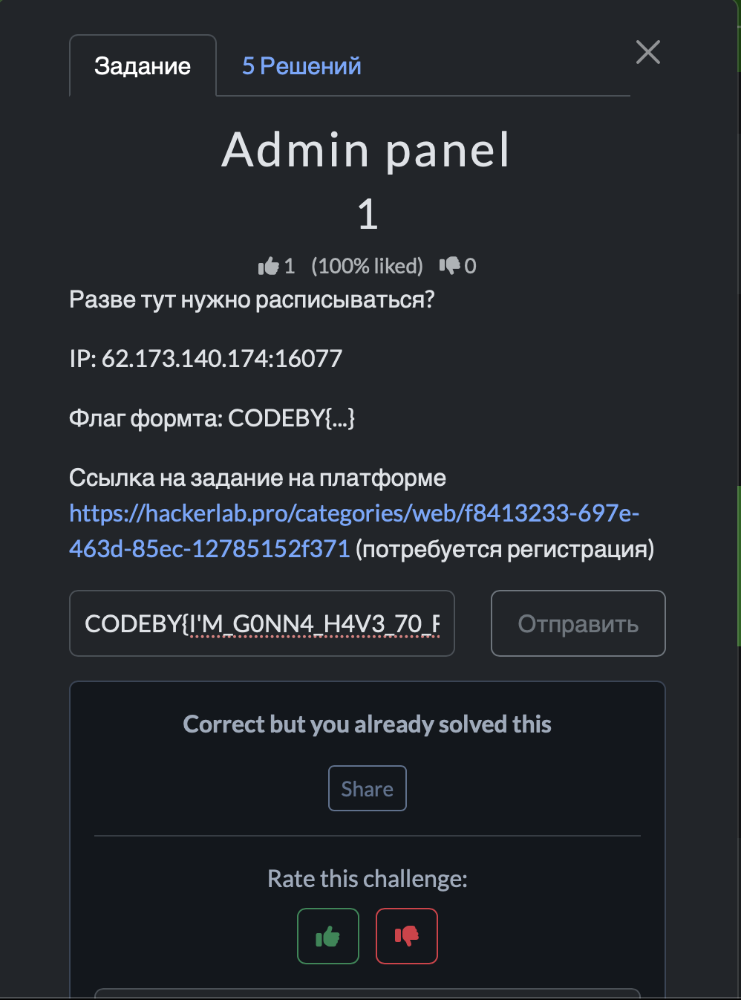

# Отчет по заданию: Admin panel

## Исходные данные
IP: `62.173.140.174:16077`.

## Шаги выполнения
1. Открытие сайта

Открываем Burp Suite и в появившемся окне нажмем `Open Browser`, для открытия встроенного браузера Chromium, можно также использовать прокси, но как по мне вариант с встроенным браузером удобнее

Переходим на `http://62.173.140.174:16077`, видим возможность войти или создать аккаунт:

Зарегистрируемся:

После видим роль user и возможность войти в админ панель:

Перейдем в админ панель и видим фейковый флаг:

Перейдем в HTTP history Burp Suite и посмотрим запрос открытия админ панели:

В куки виден токен, вероятнее всего это JWT, декодируем центр (он всегда кодируется в base64) и посмотрим данные которые там хранятся:

Изменим `user` на `admin` и закодируем в base64:

Вставим полученную строку вместо прошлой и отправим запрос:

И видим тут настоящий флаг

## Результат

В ходе анализа обнаружен флаг:

`CODEBY{I'M_G0NN4_H4V3_70_F1R3_7H3_C0D3R}`

