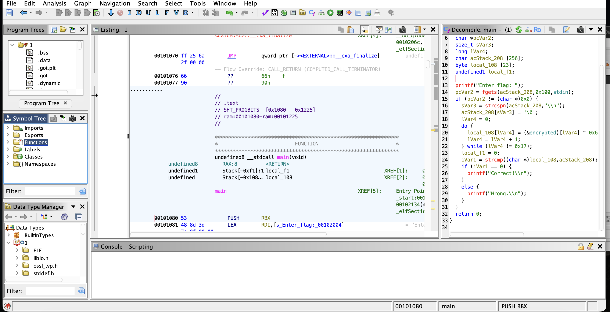
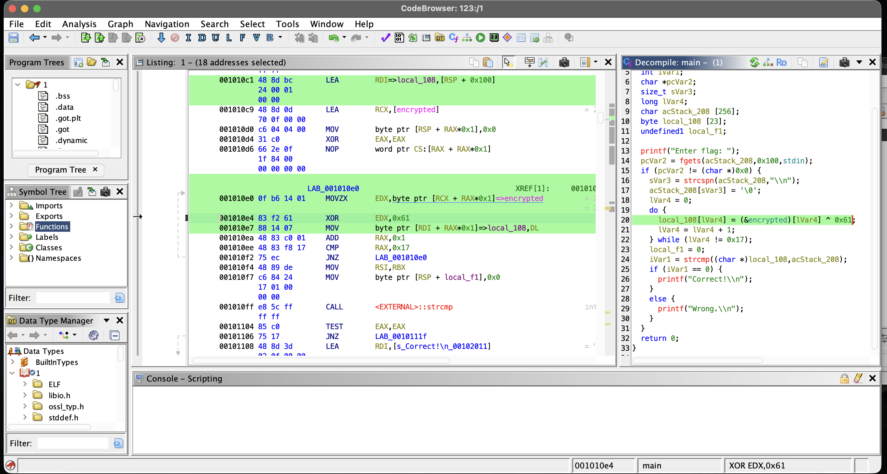
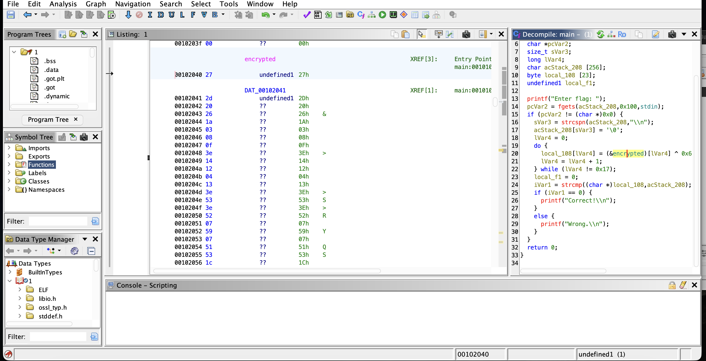
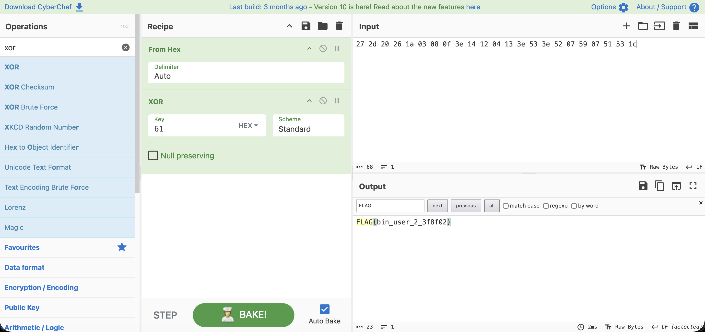
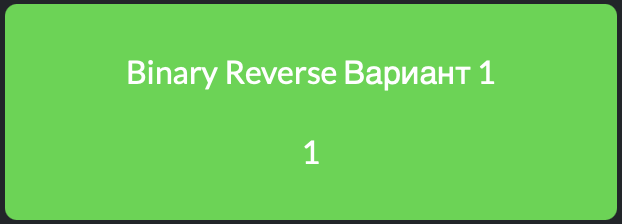

# Отчет по заданию: Binary Reverse

## Исходные данные
Файл: `1`.

## Шаги выполнения
1. Поиск и извлечение данных

Запускаем ghidra, загружаем туда файл и запускаем анализ.

Видим функцию main:

Видим переменную `encypted`, которая скорее всего является закодированным флагом и XOR ключ `0x61`:

Перейдем в содержимое переменной encrypted:

Имеем HEX строку `27 2d 20 26 1a 03 08 0f 3e 14 12 04 13 3e 53 3e 52 07 59 07 51 53 1c`

Декодируем все это через CyberChef:

И видим тут флаг

## Результат

В ходе анализа обнаружен флаг:

`FLAG{bin_user_2_3f8f02}`

