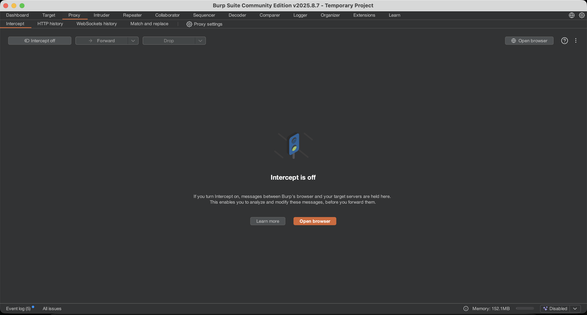

# Отчет по заданию: Node.js moment

## Исходные данные
IP: `185.70.105.203:3000`
Использование уязвимого NodeJS

## Шаги выполнения
1. Открытие сайта

Открываем Burp Suite и в появившемся окне нажмем `Open Browser`, для открытия встроенного браузера Chromium, можно также использовать прокси, но как по мне вариант с встроенным браузером удобнее

Переходим на `http://185.70.105.203:3000`, видим возможность ввести логин и пароль, введем случайные и посмотрим запросы:

2. Эксплуатация CVE-2025-29927

Погуглив находим на GitHub POC: `https://github.com/MuhammadWaseem29/CVE-2025-29927-POC`

Необходимо просто добавить заголовок в запрос: `X-Middleware-Subrequest: middleware:middleware:middleware:middleware:middleware`

Переведем запрос /api/flag, который отвечает кодомом 401. И добавим туда данный заголовок:

Видим в ответе на запрос флаг

## Результат

В ходе анализа обнаружен флаг:

`mospoly{n3Xtjs__bYp4ss_eNt0_zN4t_nAd0}`

