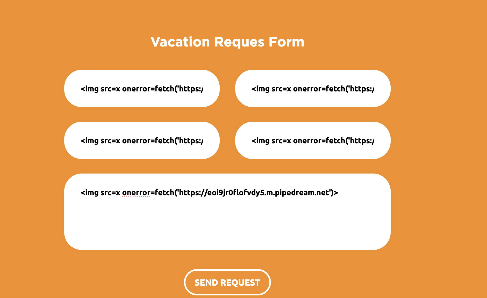
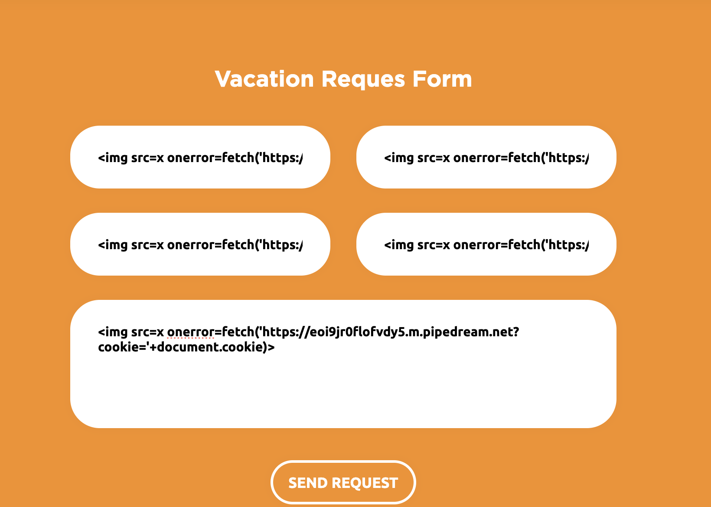

# Отчет по заданию 1

## Исходные данные
URL: `http://51.250.73.193:5001`

## Выполнение

Зарегестрируем случайного пользователя и попробуем отправить резюме с простым пэйлоадом ``:

В requestbin видим этот запрос:

Введем пэйлоад с отправкой куки ``

Но он не приходит, при попытке перекодировать в HTML или URL - тоже, при попытке отправить прошлый пэйлоад - тоже не приходит, возможно что-то случилось с ботом
