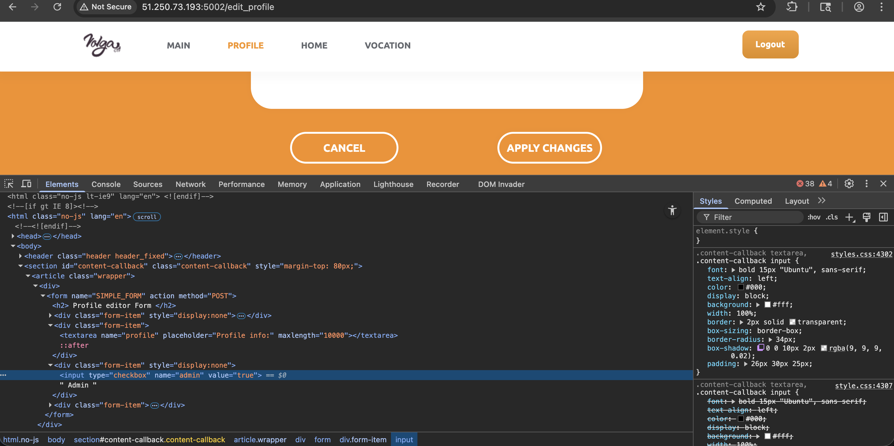
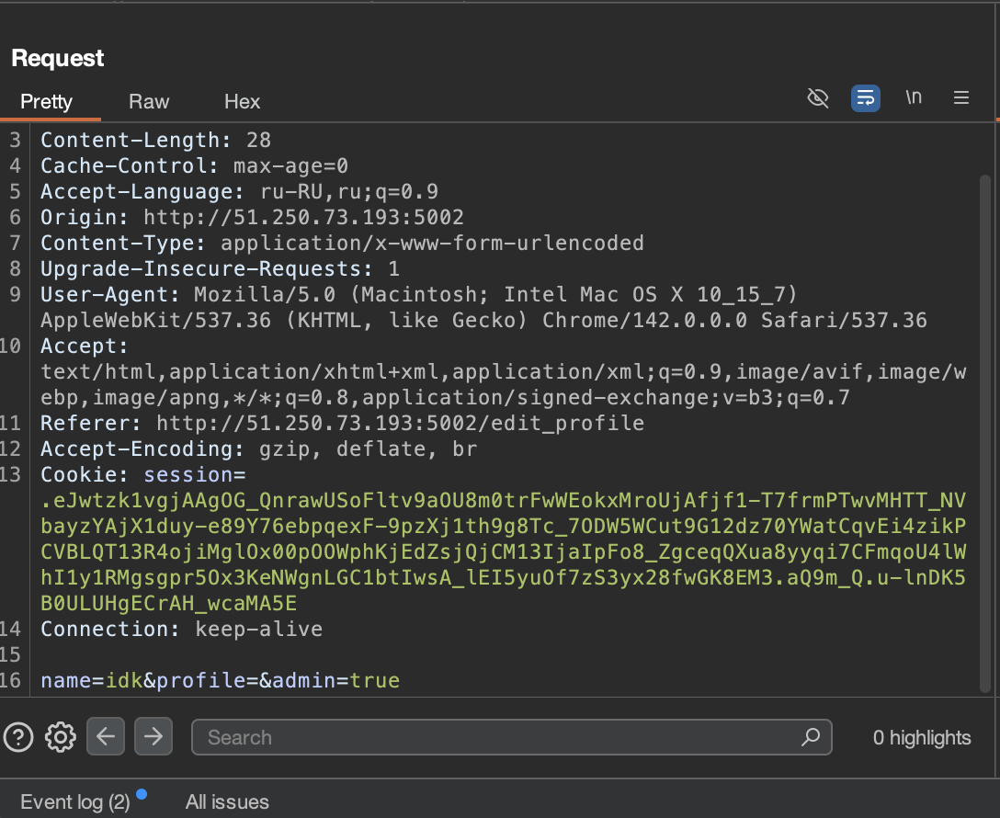
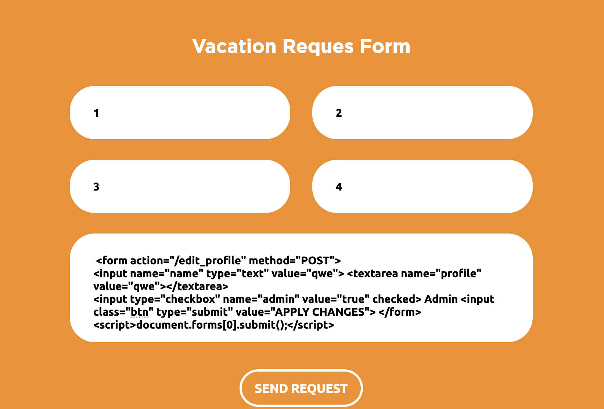

# Отчет по заданию 2

## Исходные данные
URL: `http://51.250.73.193:5002`

## Выполнение

Создадим новый аккаунт, затем перейдем в редактирование профиля и через средства разработчика увидим скрытый чекбокс:

Сделаем его видимым, активируем и посмотрим запрос в Burp Suite:

Составим форму для реализации CSRF и отправим ее через вакансии:

Но к сожалению это не работает, попробовав различные варианты - результат один, возможно проблема в боте который должен открывать данные вакансии

