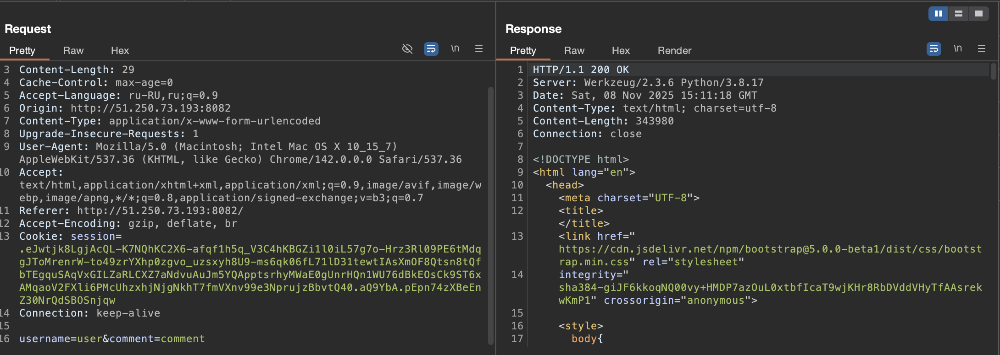
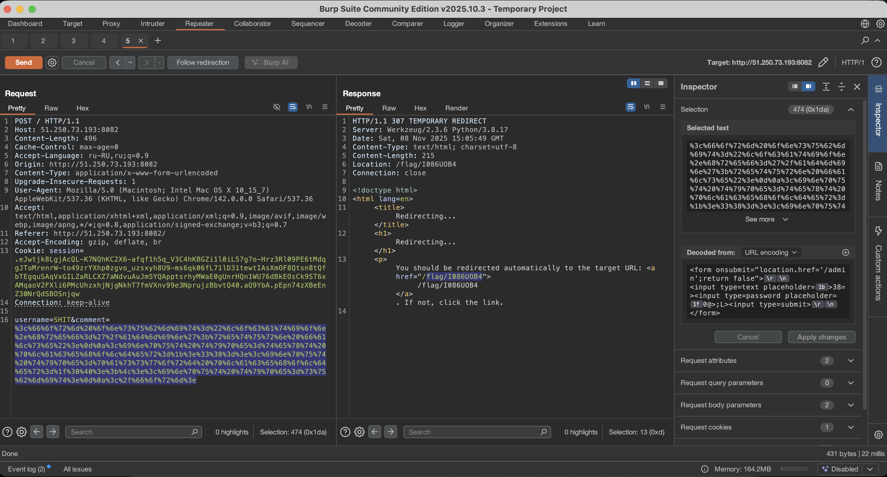
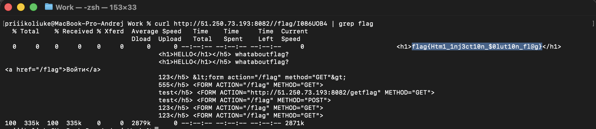

# Отчет по заданию 3

## Исходные данные
URL: `http://51.250.73.193:8082`

## Выполнение

Отправим обычный комментарий и посмортим запрос в Burp Suite:

Отправить запрос в Repeater и добавим вместо текста комментария форму закодированную в URL:

В ответ получаем редирект на `/flag/I086UOB4`, посмотрим его содержимое:

## Результат

Флаг: `flag{Htm1_1nj3ct10n_$0lut10n_fl@g}`
