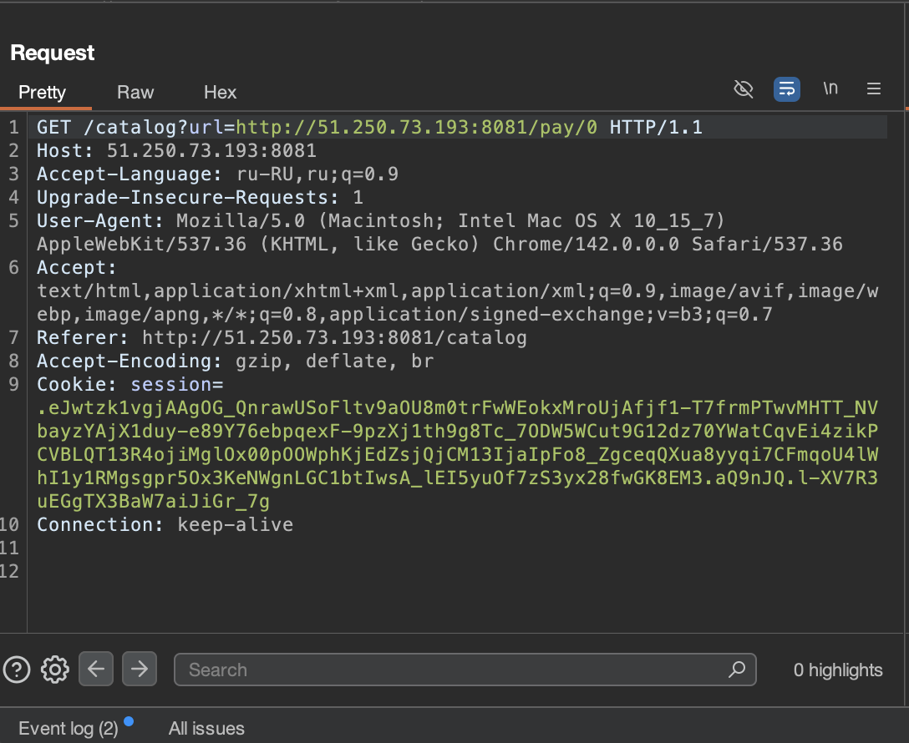
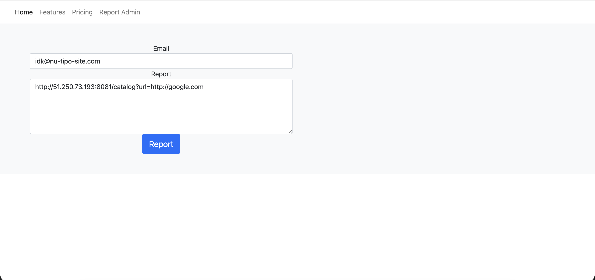
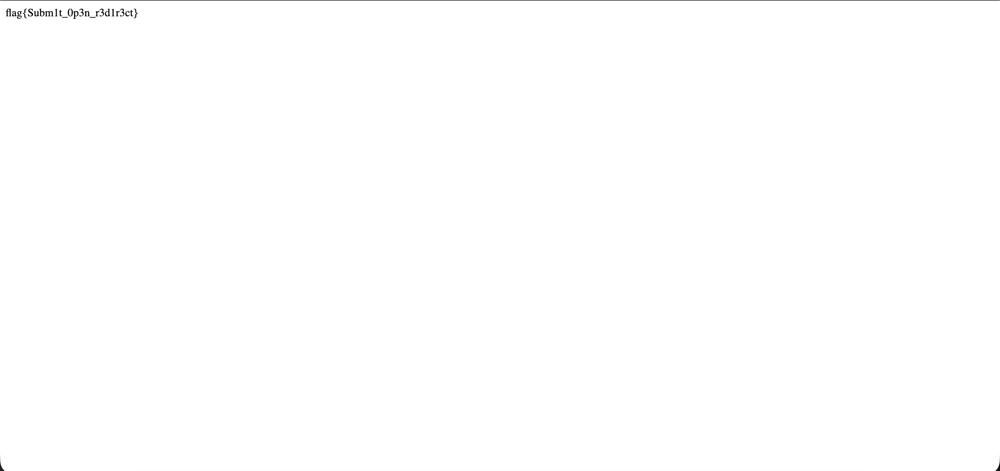

# Отчет по заданию 4

## Исходные данные
URL: `http://51.250.73.193:8082`

## Выполнение

Откроем каталог и нажмем buy, перейдем в Burp Suite и увидим запрос:

Перейдем в репорт админу и вставим URL с использование обнаруженного Open Redirct

В результате получим флаг:

## Результат

Обнаружен флаг: `flag{Subm1t_0p3n_r3d1r3ct}`

