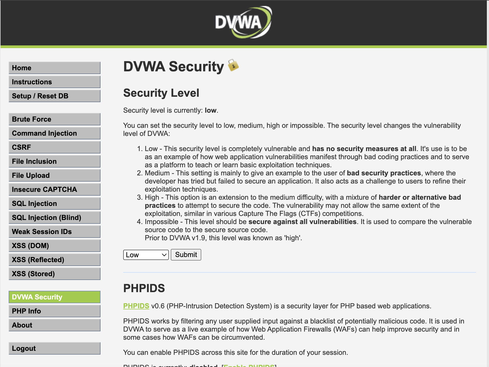
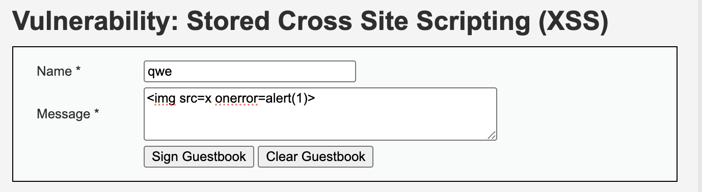
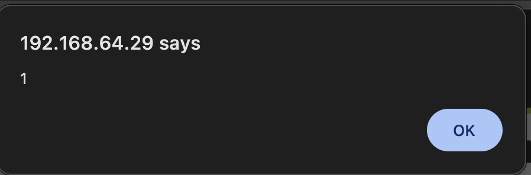
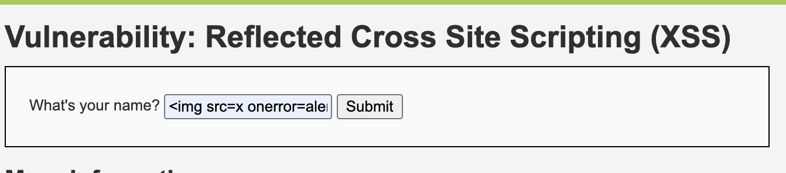
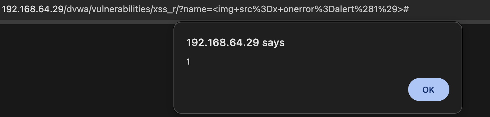
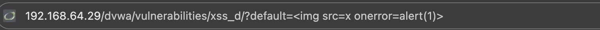
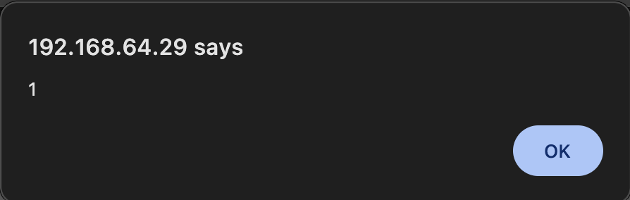

# Отчет по заданию 5

## Исходные данные
URL: `http://192.168.64.29/dvwa/`

## Выполнение

1. Смена Security Level

Для начала выставим security level на Low, как соотвествует заданию:

2. Stored XSS

Перейдем на http://192.168.64.29/dvwa/vulnerabilities/xss_s/ и введем случайное имя и простой пэйлоад:

В результате получим XSS срабатывающий при открытии страницы:

3. Reflected XSS

Перейдем на http://192.168.64.29/dvwa/vulnerabilities/xss_r/ и введем простой пэйлоад:

В результате получим XSS срабатывающий только при вводе данного поэйлоада:

4. DOM XSS

Перейдем на http://192.168.64.29/dvwa/vulnerabilities/xss_d/, нажмем Select в выборе языка, заметим изменения в адресной строке и введем в нее простой пэйлоад:

В результате получим XSS срабатывающий только при вводе данного поэйлоада или отправке данного URL:

