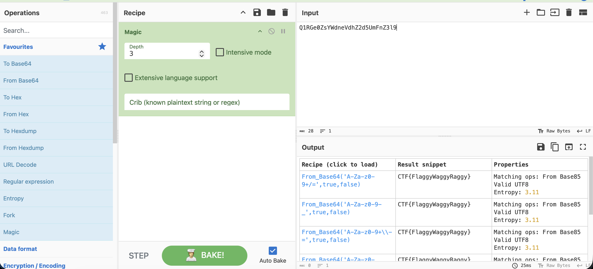

# Отчет по CTF Заданию: Base 2 2 the 6

## Исходные данные
Предоставлена строка: `Q1RGe0ZsYWdneVdhZ2d5UmFnZ3l9`.

## Шаги выполнения
1. Расшифровка закодированной информации.

Использован инструмент `CyberChef` для автоматической расшифровки строки:

Это и есть флаг, осталось написать его в нужном виде

## Результат

В ходе анализа обнаружен флаг:

`mospoly{FlaggyWaggyRaggy}`