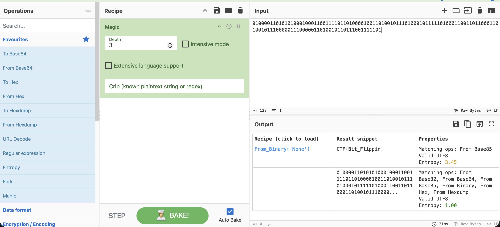

# Отчет по CTF Заданию: Reverse Polarity

## Исходные данные
Предоставлена строка: `01000011010101000100011001111011010000100110100101110100010111110100011001101100011010010111000001110000011010010110111001111101`.

## Шаги выполнения
1. Расшифровка закодированной информации.

Использован инструмент `CyberChef` для автоматической расшифровки строки:

Это и есть флаг, осталось написать его в нужном виде

## Результат

В ходе анализа обнаружен флаг:

`mospoly{Bit_Flippin}`