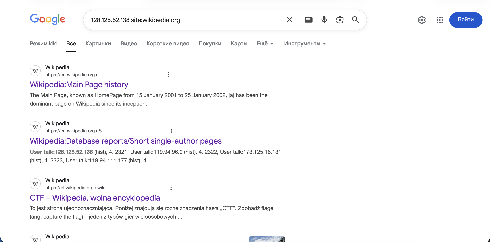
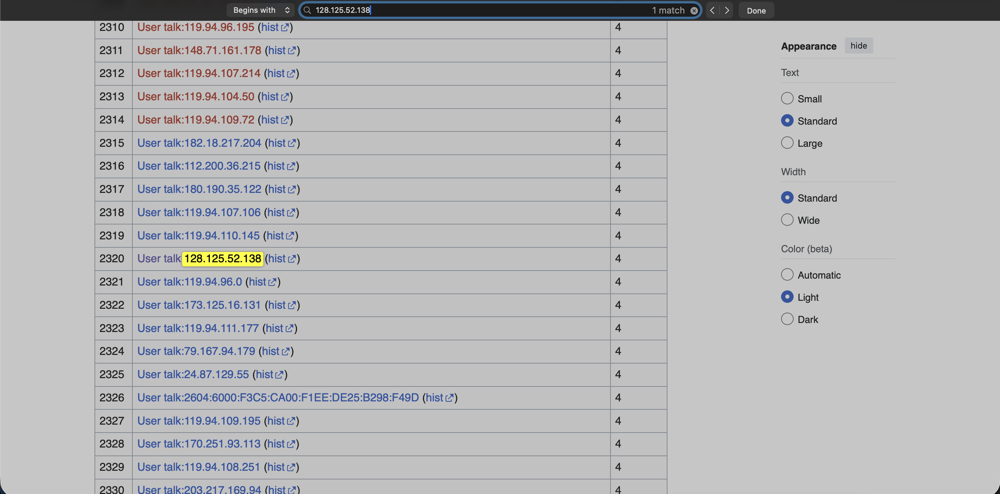
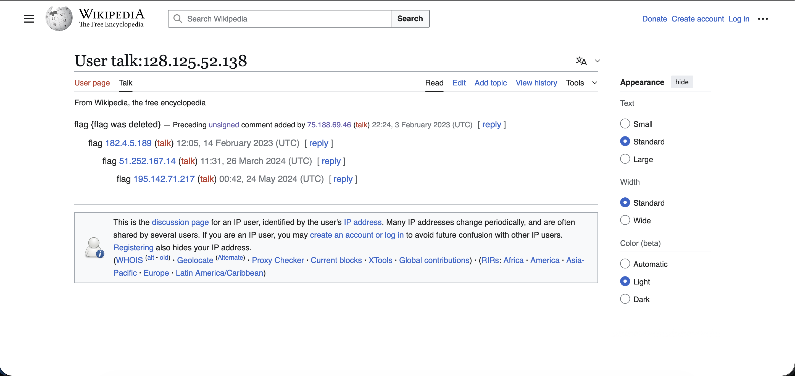
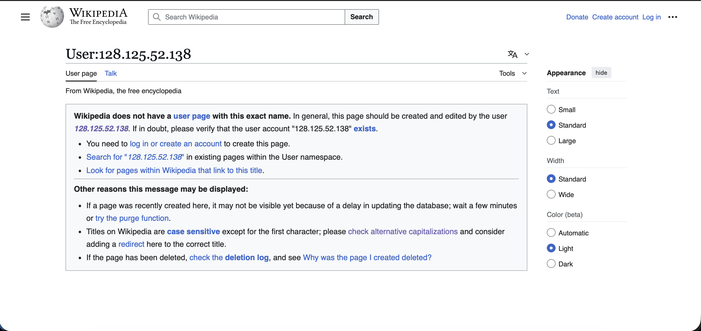
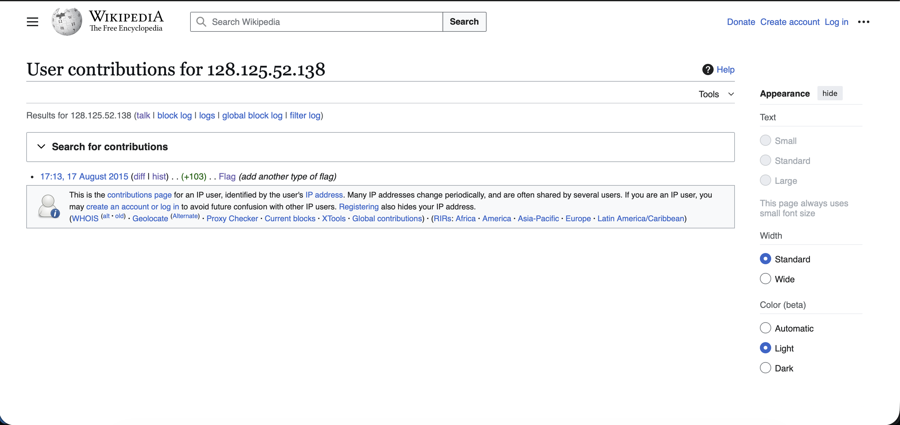
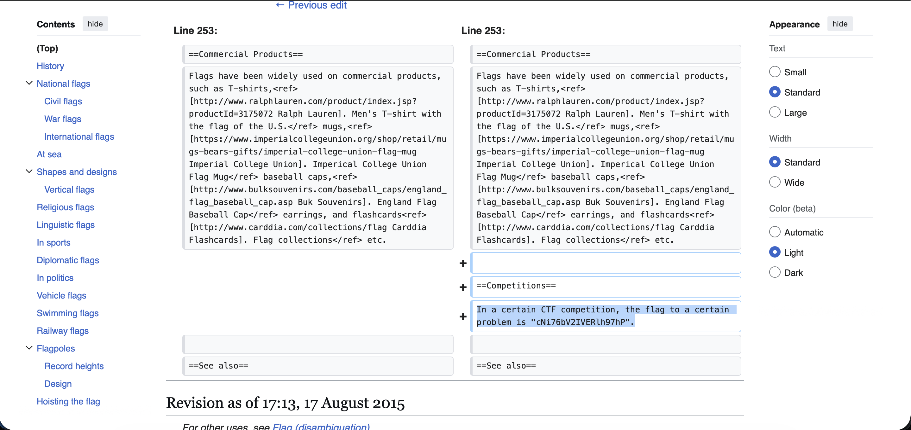

# Отчет по CTF Заданию: Wikipedia

## Исходные данные
Предоставлен ip: `128.125.52.138`.

## Шаги выполнения
1. Общий поиск в гугле

Заходим в поискик и ищем `128.125.52.138 site:wikipedia.org`:

2 результат выглядит довольно интересно

2. Поиск на странице

Заходим на страницу и ищем через cmd (ctrl) + F:

3. Просмотр найденного юзер толка:

Видим надпись о том что флаг удален, значит копаем дальше

4. Перейдем в user page:

Нажмем на 128.125.52.138 для просмотра того что изменял, добавлял данный пользователь:

5. Перейдем в diff и увидим интересную строчку которую добавлял данный пользователь:

Набор букв и есть флаг, осталось написать его в нужном виде
## Результат

В ходе анализа обнаружен флаг:

`mospoly{cNi76bV2IVERlh97hP}`