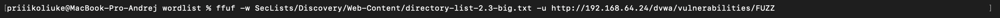
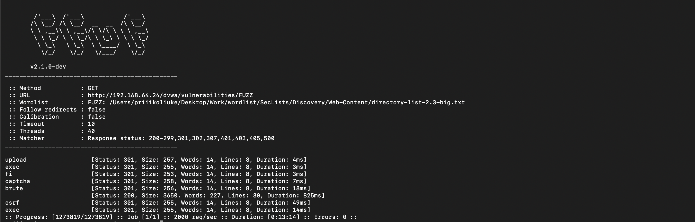

# Отчет по Заданию 1

## Исходные данные
IP metasploitable 3: `192.168.64.24`.
Директория в которой необходимо провести сканирование: `/dvwa/vulnerabilities`

## Шаги выполнения
1. Запуск перебора директорий

В задании упоминается dirbuster, но будем использовать ffuf т.к. он более гибкий и быстрый
Wordlist для директорий возьмем из Seclists

Запускаем перебор директорий:

По завершению получаем результат:

По заданию флаг - количество обнаруженных директорий
## Результат

В ходе анализа обнаружен флаг:

`7`