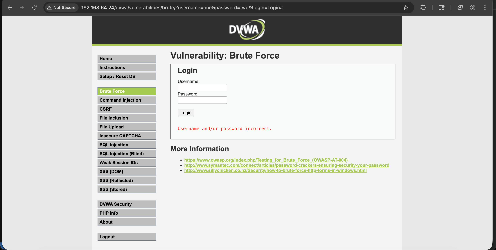

# Отчет по Заданию 2

## Исходные данные
IP metasploitable 3: `192.168.64.24`.
Директория в которой необходимо провести брутфорс: `/dvwa/vulnerabilities/brute`
Security Level: Low
Словарь с логинами: [username.txt](./files/username.txt)
Словарь с паролям: [passwords.txt](./files/password.txt)

## Шаги выполнения
1. Смена Security Level

Изначально DVWA использует Security Level impossible, но т.к. по заданию нам нужен Low - поменяем:

Переходим в `http://192.168.64.24/dvwa/security.php`

Меняем Security Level на Low:

2. Брутфорс

Открываем Burp Suite и в появившемся окне нажмем `Open Browser`, для открытия встроенного браузера Chromium, можно также использовать прокси, но как по мне вариант с встроенным браузером удобнее

Переходим на `http://192.168.64.24/dvwa/vulnerabilities/brute` и вводим любые значения логина и пароля:

В Burp Suite, в разделе HTTP history видим запрос с логином и паролем который был отправлен на сервер:

Перенесем его в Intruder сочетанием CMD + I (На Windows: CTRL + I), выберем режим Cluster Bomb и расставим позиции для перебора, для этого добавим символы `§`
В payloads загрузим из файлов из каждой позиции соответсвующий им словрь (Для username - username.txt, для password - password.txt)

Запустим атаку, подождем некоторое время и отсортируем результат по длине ответов, увидим необходимые нам логин и пароль

## Результат

В ходе анализа обнаружена комбинация логин:пароль:

`admin:password`