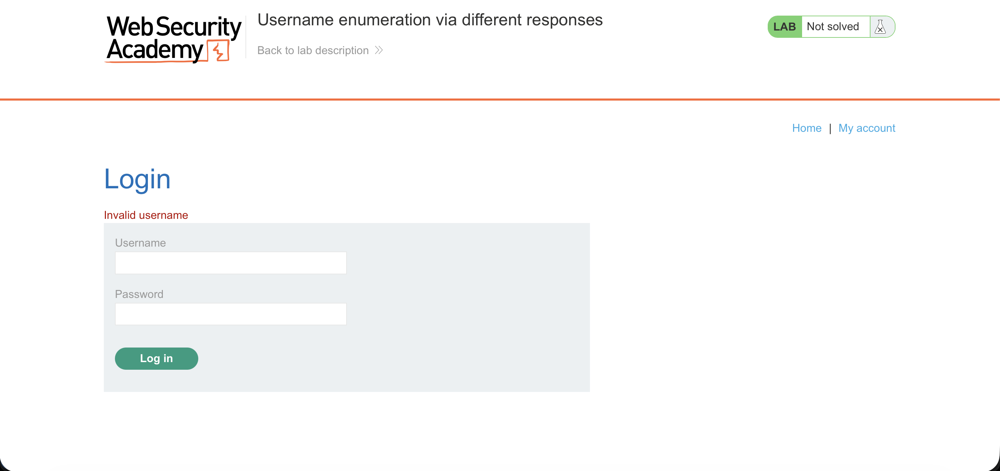
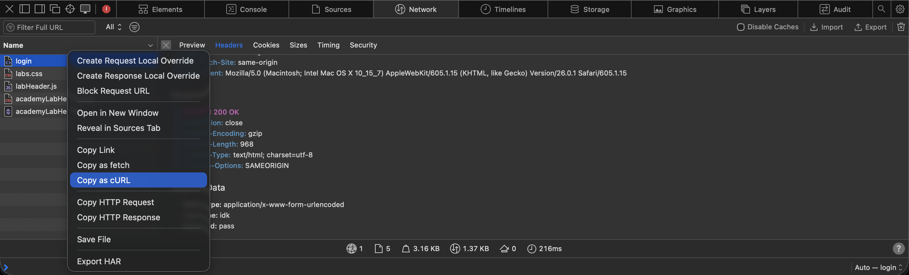
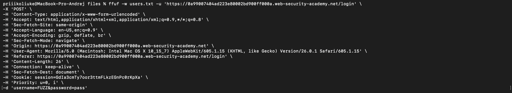
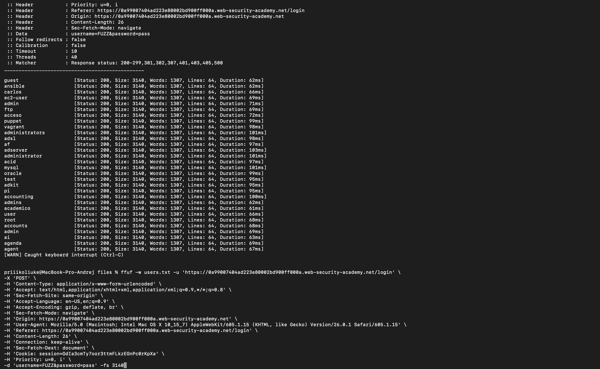
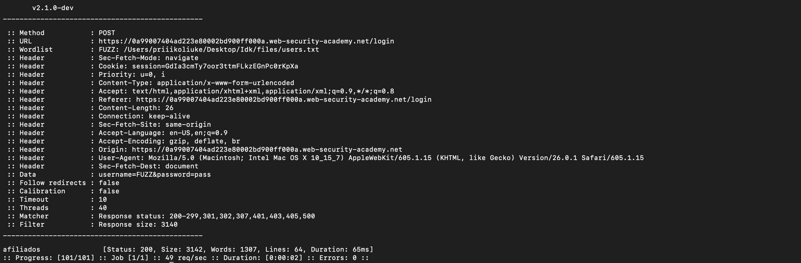
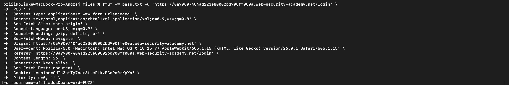
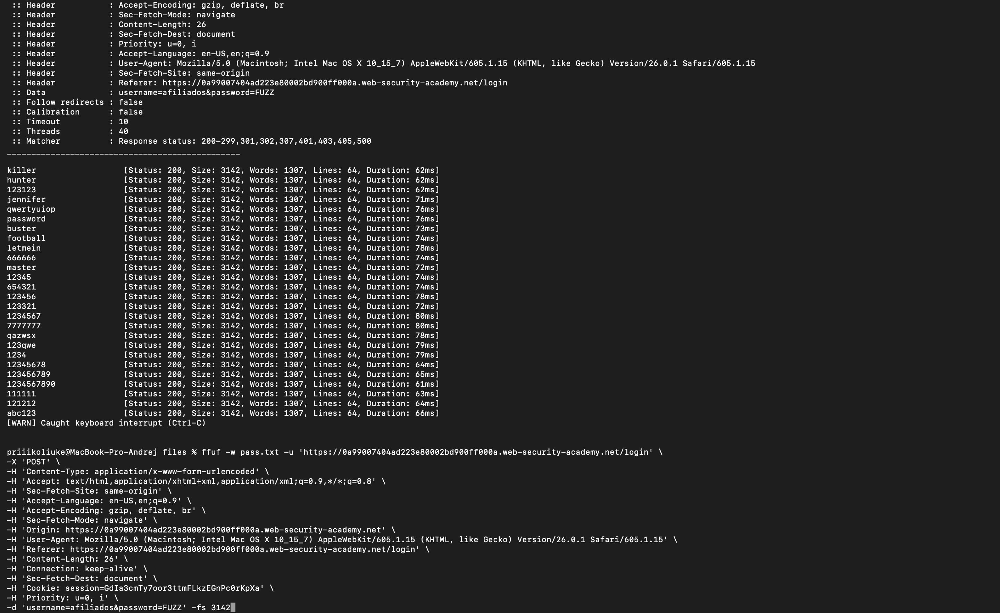
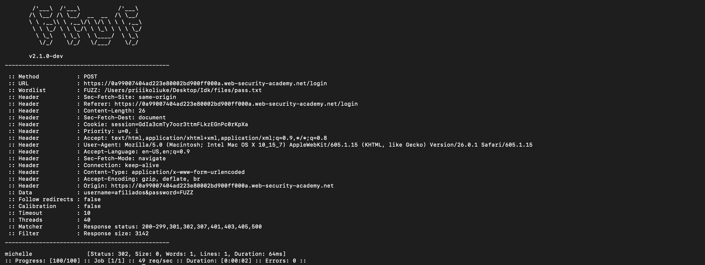
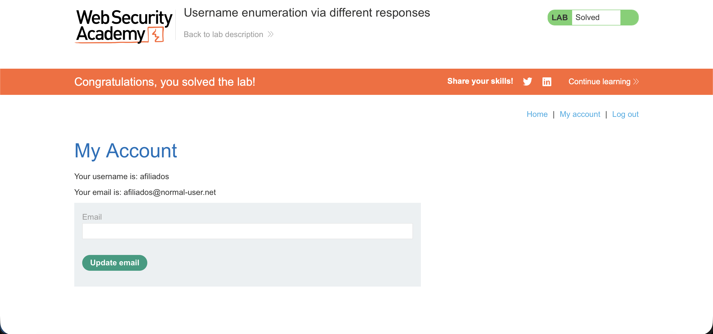

# Отчет по Заданию 3

## Исходные данные
Домен: `0a99007404ad223e80002bd900ff000a.web-security-academy.net`

Директория в которой необходимо провести брутфорс: `/login`

Словарь с логинами: [users.txt](./files/users.txt)

Словарь с паролям: [pass.txt](./files/pass.txt)

## Шаги выполнения
1. Брутфорс логинов

Переходим в `https://0a99007404ad223e80002bd900ff000a.web-security-academy.net/login`

При вводе некорректоных логина и пароля видим надпись "Invalid username", значит можем перебрать сначала логин, а затем пароль для найденного логина, это сэкономит кучу времени:

Для перебора можно использовать Burp Suite, но он медленный в Community Edition, а Professional у меня нет, поэтому я буду использовать вместо этого ffuf, для этого в инструменте разработчика в вкладке Network скопируем запрос `login` как для curl: 

И вставим его в ffuf (Перед этим убрав вначале curl и изменив --data на -d, а также заменив значение логина на FUZZ):

В результате у нас будет куча запросов для удобства закончим выполнение ffuf (нажатием CTRL + C) и добавим фильтрацию по размеру с помощью ключа `-fs`:

После выполнения получим валидный логин:

Логин: `afiliados`

2. Брутфорс пароля

Для перебора пароля будем использовать тот же ffuf, для этого будем использовать запрос полученный до этого в шаге 1 (Перед этим убрав вначале curl и изменив --data на -d, а также заменив значение логина на найденный в шаге 1, а пароля на FUZZ)

В результате у нас будет куча запросов для удобства закончим выполнение ffuf (нажатием CTRL + C) и добавим фильтрацию по размеру с помощью ключа `-fs`:

После выполнения получим валидный пароль:

Пароль: `michelle`

3. Проверка

Дополнительно проверим найденный логин и пароль, введя их:

Видим успешный вход и поздравление с выполнением, значит все хорошо

## Результат

В ходе анализа обнаружена комбинация логин:пароль:

`afiliados:michelle`
