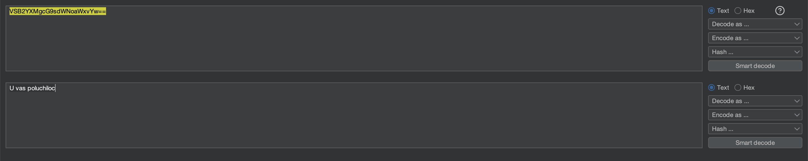

# Отчет по Заданию 4

## Исходные данные
Строка: `VSB2YXMgcG9sdWNoaWxvYw==`.

## Шаги выполнения
1. Декодирование через Burp Suite

Откроем Burp Suite, перейдем в раздел Decoder и вставим заданную строку, по виду похожа на base64 (характерное для нее окончание ==), поэтому попробуем декодировать ее данным методом:

## Результат

В ходе анализа обнаружена строка:

`U vas poluchiloc`