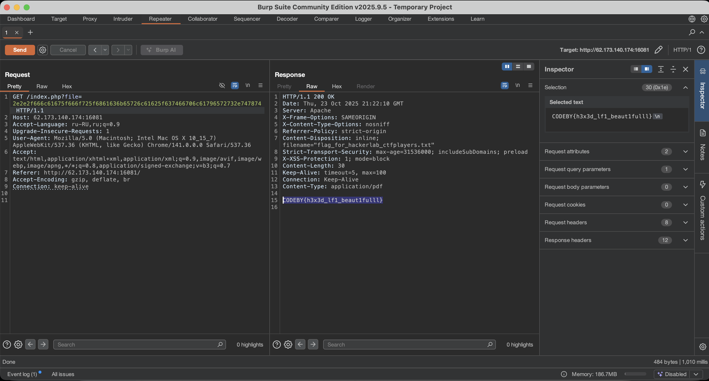

# Отчет по заданию: PDF-библиотека

## Исходные данные
IP: `62.173.140.174:16081`.

## Шаги выполнения
1. Открытие сайта

Открываем Burp Suite и в появившемся окне нажмем `Open Browser`, для открытия встроенного браузера Chromium, можно также использовать прокси, но как по мне вариант с встроенным браузером удобнее

Переходим на `http://62.173.140.174:16081`, видим возможность открыть 2 PDF файла, откроем один из них и посмотрим запросы:

2. LFI

Последний отправленный запрос выглядит интересно, отправить его в Repeater и попробуем выполнить базовый LFI:

Видим отрицательный результат, возможно название файла как-то кодируется, проверим это через CyberChef:

Видим что кодируется через HEX, попробуем тогда `/etc/passwd` перевести в HEX и отправить запрос:

Видим положительный результат, но флага в данном файле нет, проверим тогда главную страницу на наличие ссылок на конфиги или полезную информацию:

Видим интересное упоминание названия файла `flag_for_hackerlab_ctfplayers.txt` и надпись `Moved to upper directory`, попробуем посмотреть файл добавив вначале `../` для поднятия по директории:

И видим тут флаг

## Результат

В ходе анализа обнаружен флаг:

`CODEBY{h3x3d_lf1_beaut1fulll}`