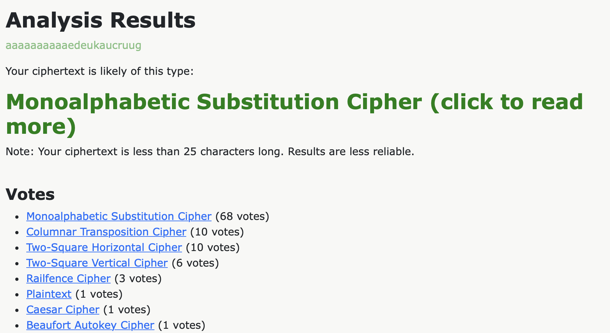
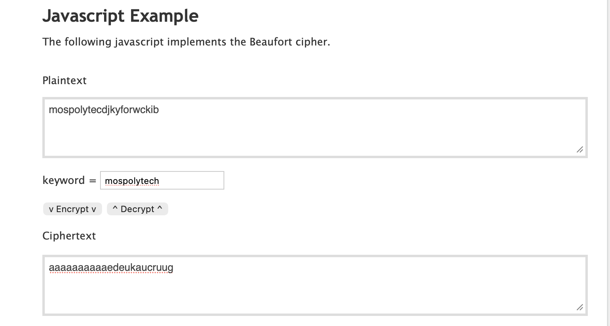
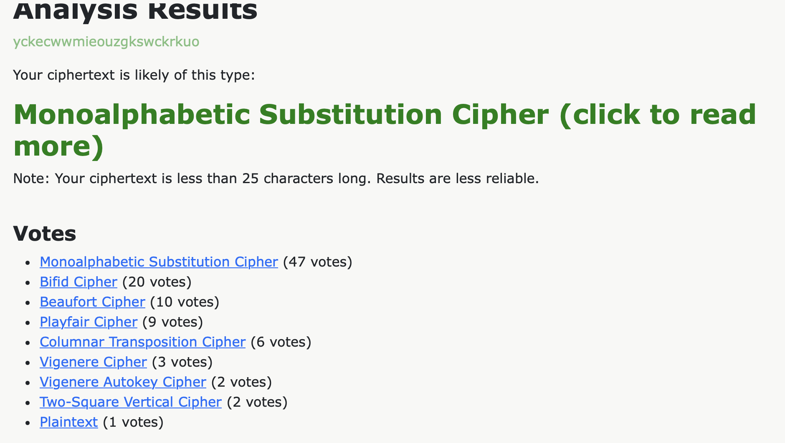
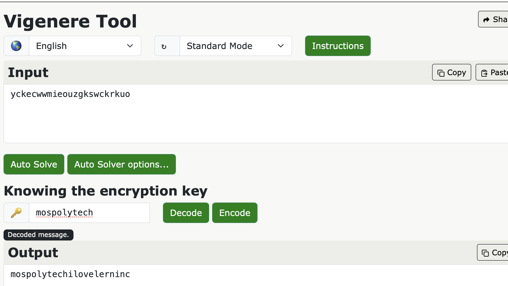
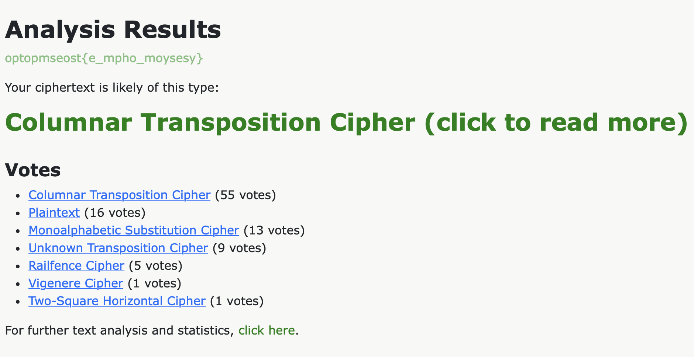
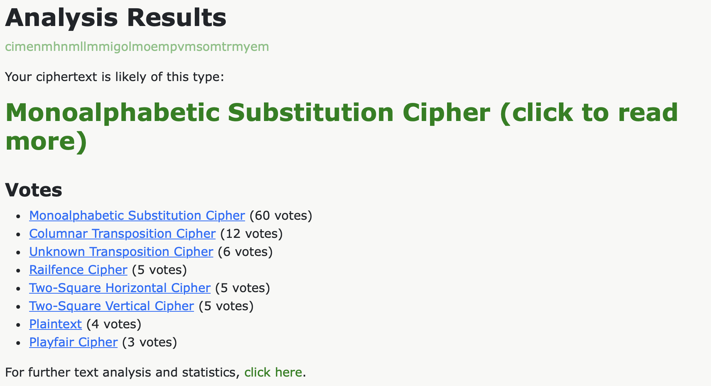
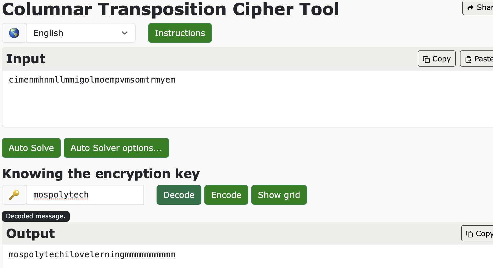
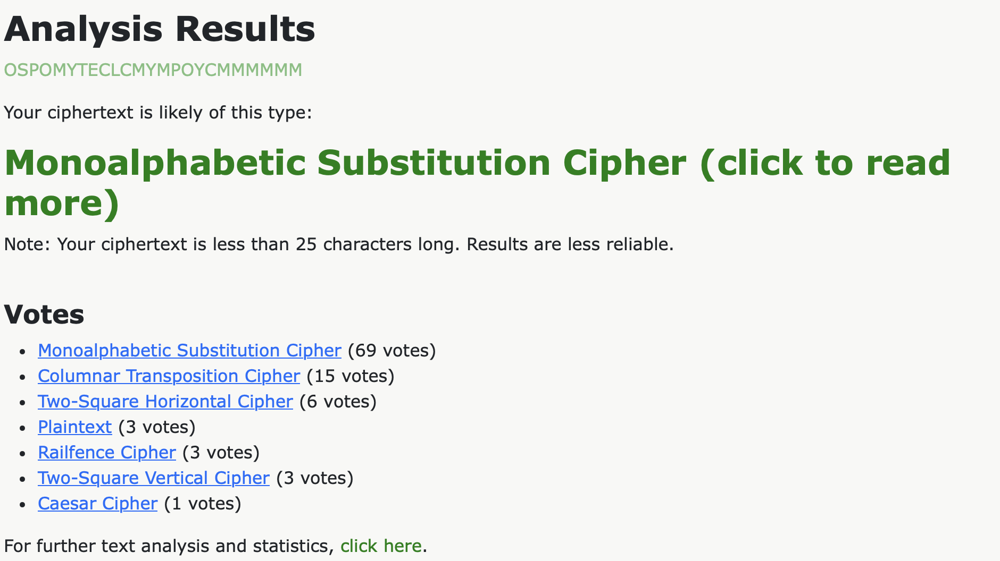

# Отчет по заданию на криптографию

## Исходные данные
Даны строки: `e`
            `yckecwwmieouzgkswckrkuo`
            `optopmseost{e_mpho_moysesy}`
            `cimenmhnmllmmigolmoempvmsomtrmyem`
            `OSPOMYTECLCMYMPOYCMMMMMM`

## Выполнение
1. Идентифицируем первый шифр

Используем `https://www.boxentriq.com/code-breaking/cipher-identifier`:

Испробовав каждый из результатов, более менее подходящим оказался Beafort:

2. Идентифицируем второй шифр

Использован тот же инструмент что и в прошлом:

Испробовав каждый из результатов, более менее подходящим оказался Vigenere:

3. Идентифицируем третий шифр

Использован тот же инструмент что и в прошлом:

Испробовав каждый из результатов, никакой не оказался нормальным, возможно нет подходящего в базе данного анализатора

4. Идентифицируем четвертый шифр

Использован тот же инструмент что и в прошлом:

Испробовав каждый из результатов, более менее подходящим оказался Columnar Transposition:

5. Идентифицируем пятый шифр

Использован тот же инструмент что и в прошлом:

Испробовав каждый из результатов, никакой не оказался нормальным, возможно нет подходящего в базе данного анализатора
