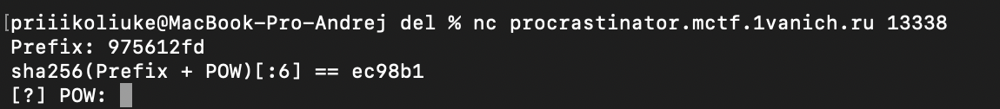
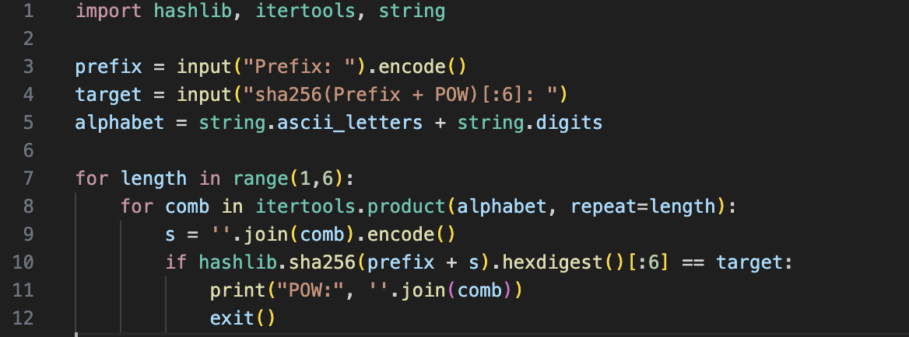
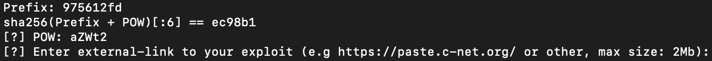
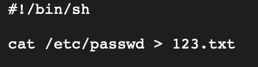
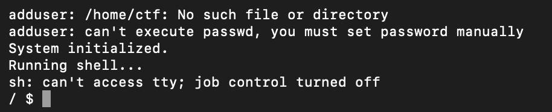
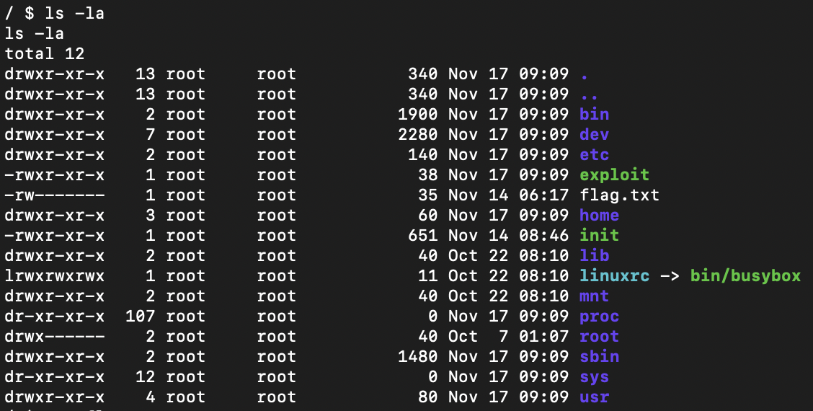

# Отчет по CTF Заданию: Procrasti nation

## Исходные данные
Строка: `nc procrastinator.mctf.1vanich.ru 13338`.

## Выполнение
Подключимся по данной строке:

Видим строки, которые означают что нужно подобрать некий POW, который является частью sha256

Напишем простенький скрипт для автоматического находа данного POW:

Запустим скрипт с нужными параметрами и получим POW: `aZWt2`, проверим:

POW подошел, но теперь нужно ввести некий URL с эксплоитом, можно конечно попробовать Reverse Shell, но т.к у меня нет белого IP, я попробую что-нибудь другое и загружу на paste.c-net, например:

Вставим данный URL и увидим шелл, который работает независимо от введеного URL:

Посмотрим листинг текущей директории и увидим flag.txt, но прочитать который мы не можем, а также не видим тот 123.txt файл из загруженного кода:

Также примерно через минуту шелл закрывается и все нужно делать по новой

