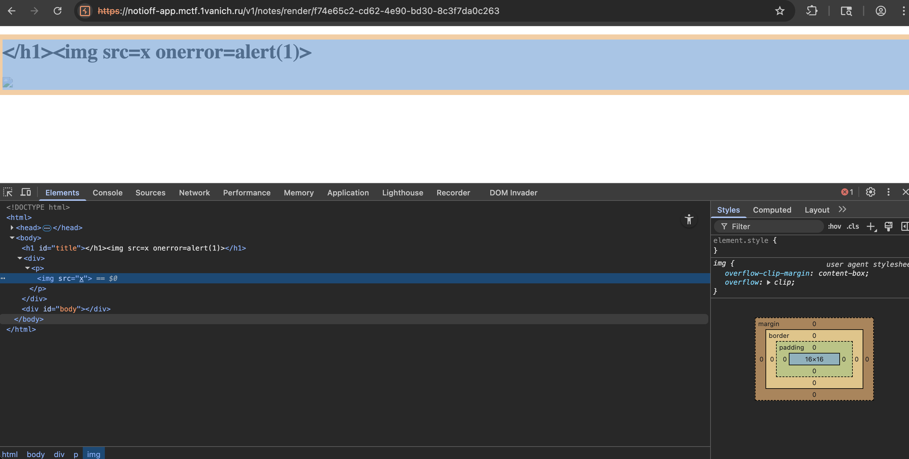

# Отчет по CTF Заданию: Notioff

## Исходные данные
Url: `https://notioff-app.mctf.1vanich.ru`,
Строка: `bot: nc notioff-bot.mctf.1vanich.ru 5555`

## Выполнение
Перейдем на данный URL и зарегестрируемся, после увидим возможность создать заметку. Судя по всему т.к есть строка с упоминанием бота - нужно сделать XSS который будет отправлять куки на сервер, попробуем:

Видим то что onerror фильтруется, также попробовав разные другие on-методы они отбрасываются, попробовал закодировать в HTML - успеха нет

