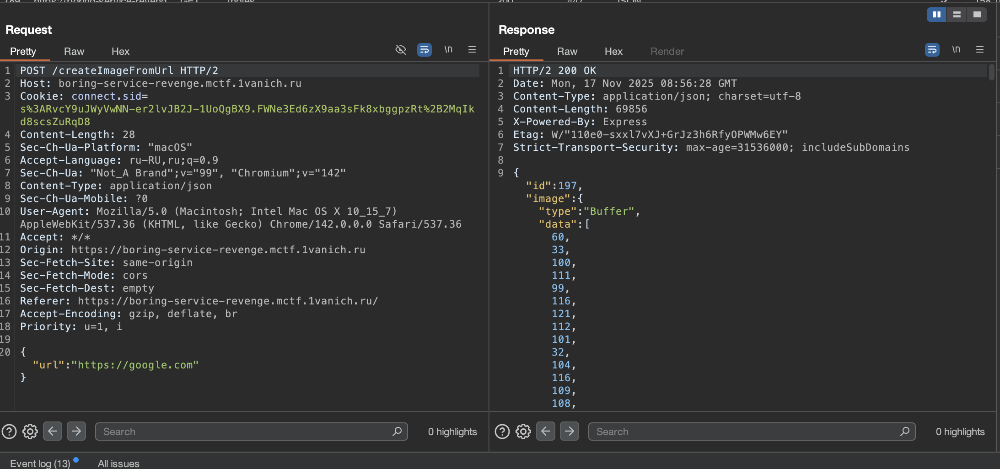
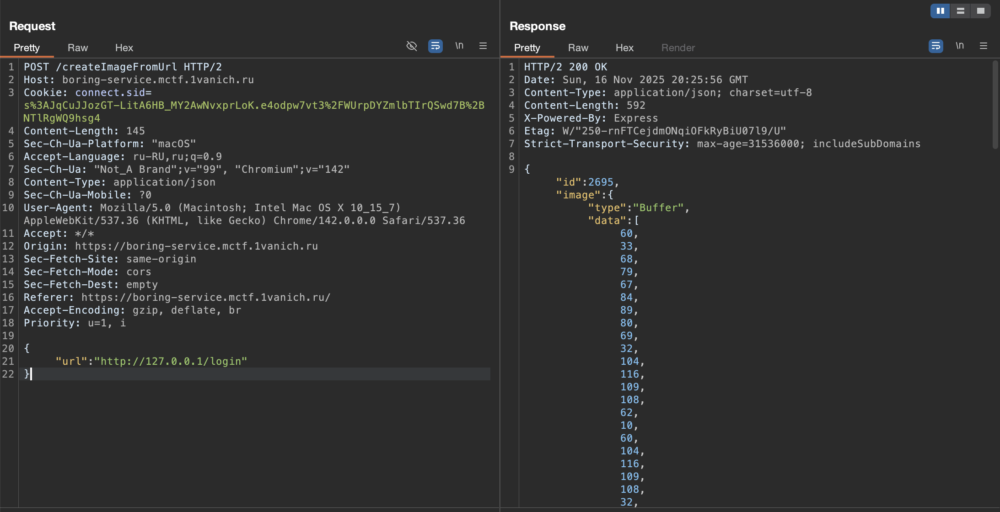

# Отчет по CTF Заданию: Boring Service

## Исходные данные
Url: `https://boring-service.mctf.1vanich.ru`

## Выполнение
Перейдем на данный URL и зарегестрируемся, после увидим возможность загрузить фото по файлу или URL. По файлу можно загрузить хоть PHP, но исполняться он не будет. 

Попробуем загрузить по URL:

Попробуем выполнить SSRF, заменив url на локальный:

Видим, что запрос проходит - значит фильтра на такое нет, но к сожалению реализовать так и не получилось, испробовав разные варианты