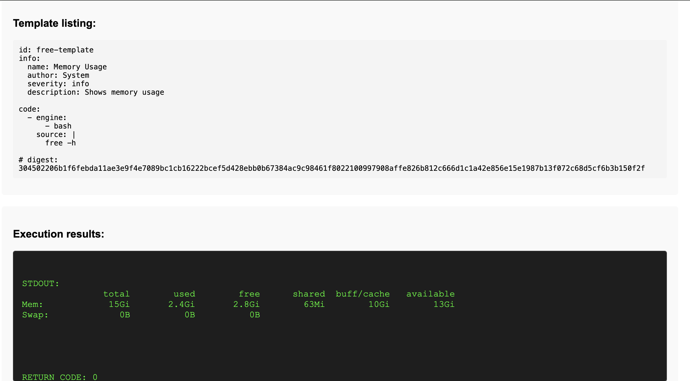
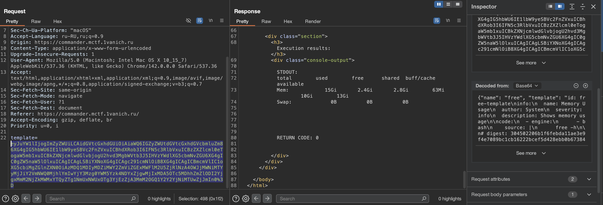

# Отчет по CTF Заданию: Commander

## Исходные данные
Url: `https://commander.mctf.1vanich.ru`

## Выполнение
Перейдем на данный URL и увидим возможность выполнить код по заранее указанному шаблону:

Через Burp Suite видим что отправляется закодированный в Base64 параметр:

Попробовав изменить команду на любую другую будет ошибка - идет проверка digest, обойти которую не удалось